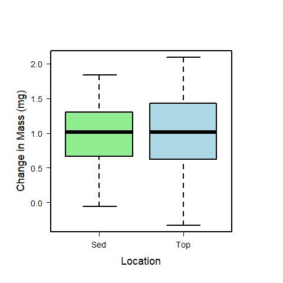

# Analysis of Leaf LOI LPNL experiment 14 Weeks

## Created:

* 6 March 2019

## Modified

* 25 April 2019 - KF - Completed analysis of LOI based on difference
* 18 March 2021 - KF - Added summary stats

## Authors

* KF
* AO
* GH

## Description

## Analysis

### Import Data

    LOI14 <- read.table("./data/leaf_LOI_week14.csv", header = T, sep = ",") # for the 14 week incubation
    
## For 14 Week Incubation
    
### Calculated Variables
    
    leaf_mass <- LOI14$Cruc_leaf_mass - LOI14$Cruc_mass
    ash_mass <- LOI14$Cruc_ash_mass - LOI14$Cruc_mass    

#### Convert negative numbers in ash mass to 0

    ash_mass[ash_mass <= 0] <- 0
    
#### Convert negative leaf_mass to NA
    
    leaf_mass[leaf_mass <= 0] <- NA

    AFDM_samp <- leaf_mass - ash_mass
    
#### Estimate the AFDM of a single leaf disc
    
    AFDM_disc <- AFDM_samp / LOI14$Leaf_number

### Initial Leaf Mass of a single leaf disc from sediment_priming exp
    
    Initial_leaf_mass <- 0.00354
    
### Calculate Mass Lost from a Single Leaf Disc
    
    mass_loss_disc <- Initial_leaf_mass - AFDM_disc
    
### Create Data frame with calculated variable
    
    mass_loss_14weeks <- data.frame(LOI14, AFDM_disc, AFDM_samp, ash_mass, leaf_mass, mass_loss_disc)
    
#### Variable Descriptions in mass_loss_14weeks 
    
* Treat = the description of the treatment level combinations, where NG is no glucose addition, YG is glucose addition, NN is no nutrient addition, and YN is N and P addition.

* Location = the description of the location of the leaf discs during incubation, where "Sed" indicates that the leaf discs were incubated in contact with the sediments and "Top" indicates that the leaf discs were incubated on a wire shelf 4 cm above the sediment surface.
    
* Glucose = the identifier if glucose was added to the jar, where Y is yes, and N is no.
    
* Nutrients = the identifier if N and P were added to the jar, where Y is yes, and N is no.
    
* Cruc_number = the number label on the crucuble used in LOI determination.
    
* Cruc_mass = the mass of the crucible used in LOI determination in grams.
    
* Leaf_number = the number of leaf discs that were in the crucuble used for LOI determination.
    
* Jar = the replicate identifier on the jar.
    
* Cruc_leaf_mass = the mass of the crucible and leaf discs before ashing at 550 dC (g).
    
* Cruc_ash_mass = the mass of the crucible and ash after ashing at 550 dC (g).
    
* leaf_mass = the mass of all the leaf discs in the crucible before ashing at 550 dC (g).
    
* ash_mass = the mass of the total amount of ash in the crucibe after ashing at 550 dC (g).
    
* AFDM_samp = the AFDM of the total sample (all the leaves) in the crucible (g).
  
* AFDM_disc = the estimated AFDM of a single leaf determined by dividing AFDM_samp by leaf_number (g).
    
* mass_loss_disc = the estimated change in mass of the leaves over the 14 day incubation based on the initial mass of the leaves sampled from the same leaves used in the incubation (g).

## Summary Statistics
### ADFM of a single leaf disc
    
    tapply(mass_loss_14weeks$AFDM_disc, mass_loss_14weeks$Location, summary, na.rm = T)
    tapply(mass_loss_14weeks$AFDM_disc, mass_loss_14weeks$Location, sd, na.rm = T)
    
    ##################################################
    # AFDM of a single leaf disc at the end of the 14 week incubation in the different locations.
    
    $Sed
    Min.      1st Qu.   Median     Mean       3rd Qu.     Max.        NAs  SD
    0.001700  0.002237  0.002525   0.002572   0.002875    0.003600     1    0.0005288014
    
    $Top
    Min.      1st Qu.   Median     Mean      3rd Qu.     Max.       NAs  SD 
    0.001450  0.002112  0.002525   0.002599  0.002917    0.003867    1   0.0006722819
    
    ##################################################
    
### Estimated AFDM mass loss of a single leaf disc
    
    tapply(mass_loss_14weeks$mass_loss_disc, mass_loss_14weeks$Location, summary, na.rm = T)
    tapply(mass_loss_14weeks$mass_loss_disc, mass_loss_14weeks$Location, sd, na.rm = T)
    
    ##################################################
    # Estimated AFDM mass loss of a single leaf disc at the end of the 14 week incubation in the different locations.
    
    $Sed
    Min.        1st Qu.    Median     Mean       3rd Qu.     Max.        NAs  SD
    -0.0000600  0.0006650  0.0010150  0.0009683  0.0013025  0.0018400    1    0.0005288014
    
    $Top
    Min.        1st Qu.    Median     Mean      3rd Qu.     Max.       NAs  SD 
    -0.0003267  0.0006233  0.0010150  0.0009411  0.0014275  0.0020900  1    0.0006722819 
    
    
    ##################################################

    
    
    
    
## Analysis
    
### Calc the differenece between the TOP and SED samples
    
    mass.loss.disc.diff <- mass_loss_disc[LOI14$Location == "Top"] - mass_loss_disc[LOI14$Location == "Sed"]
    treat.diff <- LOI14$Treat[LOI14$Location == "Top"]
    
### Test the effect of the location effect on mass lost
    
    t.test(mass.loss.disc.diff, mu = 0)
    
    #===========================================
    
    One Sample t-test
    
    data:  mass.loss.disc.diff
    t = -0.40672, df = 13, p-value = 0.6908
    alternative hypothesis: true mean is not equal to 0
    95 percent confidence interval:
      -0.0003982413  0.0002720508
    sample estimates:
      mean of x 
    -6.309524e-05 
    
    #==========================================

## Analyize Treatment effect on Mass Loss
    
Since there was no effect of location, I analyzed the effect of treatment on mass loss with the locations pooled
  
    anova(lm(AFDM_disc ~ Treat, data = LOI14))
    
    #========================================
    
    Analysis of Variance Table
    
    Response: AFDM_disc
    Df     Sum Sq    Mean Sq F value Pr(>F)
    Treat      3 2.0766e-06 6.9220e-07  2.2025 0.1118
    Residuals 26 8.1713e-06 3.1428e-07  

    #========================================    
    
    par(las = 1, cex = 1, lwd = 2, mar = c(6, 6, 6, 6))
    plot(mass_loss_disc * 1000 ~ Location, data = LOI14, ylab = "Change in Mass (mg)", cex.lab = 1.5, cex.axis = 1.2, col = c("light green", "light blue"))
    dev.copy(jpeg, "./output/plots/mass_loss_location.jpg")
    dev.off()
    

    
### Plot of Mass Loss by Treatment
#### TOP    
    par(las = 1, cex = 1, lwd = 2)
    #par(mfcol = c(2, 1))
    par(mar = c(5, 5, 5, 5))
    plot(mass_loss_disc * 1000 ~ Treat, data = LOI14, subset = Location == "Top", xlab = " ", ylab = "Mass Loss (mg)", cex.lab = 1.5, cex.axis = 1.2, ylim = c(-0.5, 2.5), col = c(0, "gold1", "lightskyblue2", "olivedrab3"), axes = F, cex.lab = 0.5)
    axis(2)
    axis(1, c("No Addition", "+N +P", "+Glucose", "+Glucose\n +N + P"), at = c(1, 2, 3, 4), tick = F)
    abline(h = 0, lwd = 3)
    box()
    text(1.15, 2.5, "No Sediment Contact")
    dev.copy(jpeg, "./output/plots/mass_loss_treat_top_wk14.jpg")
    dev.off()
    
#### SED    
    par(las = 1, cex = 1, lwd = 2)
    #par(mfcol = c(2, 1))
    par(mar = c(5, 5, 5, 5))
    plot(mass_loss_disc * 1000 ~ Treat, data = LOI14, subset = Location == "Sed", xlab = " ", ylab = "Mass Loss (mg)", cex.lab = 1.5, cex.axis = 1.2, ylim = c(-0.5, 2.5), col = c(0, "gold1", "lightskyblue2", "olivedrab3"), axes = F, cex.lab = 0.5)
    axis(2)
    axis(1, c("No Addition", "+N +P", "+Glucose", "+Glucose\n +N + P"), at = c(1, 2, 3, 4), tick = F)
    abline(h = 0, lwd = 3)
    box()
    text(1, 2.5, "Sediment Contact")
    dev.copy(jpeg, "./output/plots/mass_loss_treat_sed_wk14.jpg")
    dev.off()
    
### Plot of Mass Loss Difference by Treatment
    
    par(las = 1, cex = 1, lwd = 2)
    #par(mfcol = c(2, 1))
    par(mar = c(5, 5, 5, 5))
    plot(mass.loss.disc.diff * 1000 ~ treat.diff, data = LOI14, xlab = " ", ylab = "Mass Loss Difference (mg)", cex.lab = 1.5, cex.axis = 1.2, ylim = c(-1.5, 1.50), col = c(0, "gold1", "lightskyblue2", "olivedrab3"), axes = F, cex.lab = 0.5)
    axis(2)
    axis(1, c("No Addition", "+N +P", "+Glucose", "+Glucose\n +N + P"), at = c(1, 2, 3, 4), tick = F)
    abline(h = 0, lwd = 3)
    text(2, 1.50, "No Sediment Contact is Greater")
    text(2, -1.50, "Sediment Contact is Greater")
    box()
    dev.copy(jpeg, "./output/plots/mass_loss_diff_treat_wk14.jpg")
    dev.off()
    