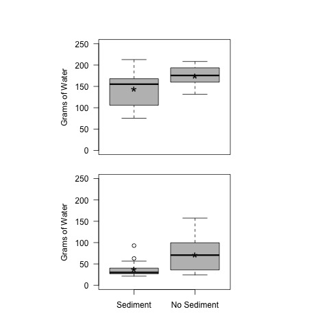

# Analysis of leaf toughness for LPNL experiment 14 Weeks

## Created:

* 14 Feb 2019

## Modified

* 25 April 2019 - KF - completed the analysis based on the diff between the top and sediment
* 25 April 2019 - KF - began coding figure of toughness difference
* 26 Feb 2020 - KF - summary stats for treatment levels 
* 11 March 2021 - KF - calculated the % difference in the mass required to puncture the leaves.
* 30 March 2021 - KF - ran the stats analysis on the % difference req to puncture the leaves.
  * this was a false start, since the stats are not appropriate for perc. diff
* 8 April 2021 - KF - Coded toughness figure for manuscript

## Authors

* Kenneth Fortino
* Alyssa Oppedisano
* Gabby Huerta

## Description

## Analysis

### Import Data

    tough2 <- read.table("./data/toughness_week2.csv", header = T, sep = ",") # for the 2 week incubation
    tough14 <- read.table("./data/toughness_week14.csv", header = T, sep = ",") # for the 14 week incubation
    
### Calculate total mass to puncture leaf
    
    tot.mass2 <- tough2$water_mass + tough2$shelf_mass + tough2$res_mass
    tot.mass14 <- tough14$Water_Mass + tough14$shelf_mass + tough14$res_mass

### Calculate the mean mass required to puncture the leaf 
    
Three replicate leaves were randomly selected from the top and sediments from each jar for use the penetrometer.  Thus we need to calculate the average for each bottle.

    mean.tot.mass2.top <- as.numeric(tapply(tot.mass2[tough2$location == "top"], tough2$bottle[tough2$location == "top"], mean))
    mean.tot.mass2.sed <- as.numeric(tapply(tot.mass2[tough2$location == "sed"], tough2$bottle[tough2$location == "sed"], mean))
    mean.tot.mass14.top <- as.numeric(tapply(tot.mass14[tough14$location == "top"], tough14$bottle[tough14$location == "top"], mean))
    mean.tot.mass14.sed <- as.numeric(tapply(tot.mass14[tough14$location == "sed"], tough14$bottle[tough14$location == "sed"], mean))
    
#### Create Data.frame of mean values
    
    mean.tot.mass2 <- c(mean.tot.mass2.top, mean.tot.mass2.sed)
    mean.tot.mass14 <- c(mean.tot.mass14.top, mean.tot.mass14.sed)
    location <- c(rep("top", 16), rep("sed", 16))
    treat <- rep(c(rep("NGNN", 4), rep("NGYN", 4), rep("YGNN", 4), rep("YGYN", 4)), 2)
    nutrients <- rep(c("N", "N", "N", "N", "Y", "Y", "Y", "Y", "N", "N", "N", "N", "Y", "Y", "Y", "Y"), 2)
    glucose <- rep(c(rep("N", 8), rep("Y", 8)), 2)

    mean.tough <- data.frame(location, treat, nutrients, glucose, mean.tot.mass2, mean.tot.mass14)    

#### Summary Statistics for Toughness based on Mass
##### Two weeks
    
    tapply(mean.tough$mean.tot.mass2, mean.tough$location, summary)
    tapply(mean.tough$mean.tot.mass2, mean.tough$location, sd, na.rm = T)
    
    ##################################################
    # Summary of the mass required to puncture the leaves based on the location in the 2 week incubation
    
    $sed
     Min.    1st Qu.  Median    Mean     3rd Qu.    Max.    SD 
     75.53   107.82   155.22    144.27   165.37     212.83  42.29959 

    $top
     Min.    1st Qu.  Median    Mean     3rd Qu.    Max.    NAs  SD
     131.3   160.0    175.7     174.7    193.6      208.3   1    22.81981
     
    ##################################################
     
##### Fourteen Weeks
     
    tapply(mean.tough$mean.tot.mass14, mean.tough$location, summary)
    tapply(mean.tough$mean.tot.mass14, mean.tough$location, sd, na.rm = T)
    
    ##################################################
    # Summary of the mass required to puncture the leaves based on the location in the 14 week incubation 
    
    $sed
     Min.    1st Qu.  Median    Mean    3rd Qu.    Max.     SD
     21.37   27.19    30.05     37.37   39.52      92.97    18.77204 

    $top
     Min.    1st Qu.  Median    Mean    3rd Qu.    Max.     SD
     24.40   36.36    70.65     72.01   99.43      157.60   37.81378 
     
    ##################################################

In the 2 week incubation there is more variation in the sed location samples.  However in the 14-week incubation, there is more variation in the top samples.
     
### Calculate Difference Between Sed and Top
    
In order to determine if there was an effect of location of the leaves on the toughness, we subtracted the tougness measurement (both as mass and percent) of the leaves not in contact with the sediments (top) from the toughness measurement of the leaves in contact with the sediment. If there was no effect of the location, then the mean difference should be equal to 0.  Since the leaves were incubated in the same mesocosms, the top and sed samples are not independent and cannot be tested against each other.
    
    mean.tot.mass2.diff <- mean.tough$mean.tot.mass2[mean.tough$location == "top"] - mean.tough$mean.tot.mass2[mean.tough$location == "sed"]
    mean.tot.mass14.diff <- mean.tough$mean.tot.mass14[mean.tough$location == "top"] - mean.tough$mean.tot.mass14[mean.tough$location == "sed"]
    
    mean.tot.mass2.percDiff <- ((mean.tough$mean.tot.mass2[mean.tough$location == "top"] - mean.tough$mean.tot.mass2[mean.tough$location == "sed"]) / mean.tough$mean.tot.mass2[mean.tough$location == "top"]) * 100
    
    mean.tot.mass14.percDiff <- ((mean.tough$mean.tot.mass14[mean.tough$location == "top"] - mean.tough$mean.tot.mass14[mean.tough$location == "sed"]) / mean.tough$mean.tot.mass14[mean.tough$location == "top"]) * 100
    
#### Create treatment name variable
    
    treat <- c(rep("NGNN", 4), rep("NGYN", 4), rep("YGNN", 4), rep("YGYN", 4))
    gluc <- c(rep("N", 8), rep("Y", 8))
    nut <- c(rep("N", 4), rep("Y", 4), rep("N", 4), rep("Y", 4))
    
#### Create data.frame
    
    diff.mean.tough <- data.frame(treat, gluc, nut, mean.tot.mass2.diff, mean.tot.mass14.diff, mean.tot.mass2.percDiff, mean.tot.mass14.percDiff)

### Summary Stats for difference
    
    summary(mean.tot.mass2.diff)
    sd(mean.tot.mass2.diff, na.rm = T)

    summary(mean.tot.mass14.diff)
    sd(mean.tot.mass14.diff, na.rm = T)
    
    summary(mean.tot.mass2.percDiff)
    sd(mean.tot.mass2.percDiff, na.rm = T)

    summary(mean.tot.mass14.percDiff)
    sd(mean.tot.mass14.percDiff, na.rm = T)
    
    ###########################
    # Mass difference between top - sed
    
    #> summary(mean.tot.mass2.diff)
    Min.      1st Qu.  Median    Mean    3rd Qu.    Max.     NAs  SD 
    -31.267   4.833    20.667    34.342  56.733     130.133  1    42.82169
    
    #> summary(mean.tot.mass14.diff)
    Min.      1st Qu.  Median    Mean    3rd Qu.    Max.   SD
    -19.833   5.008    37.467    34.640  64.858     94.700 35.55487 
    
    ##############################
    
    #############################
    # Percent difference in mass for top - sed / top
    
    ## 2 weeks
    Min.     1st Qu.  Median    Mean    3rd Qu.    Max.    NAs   SD
    -23.807   2.844    12.957    18.766  32.443     63.274   1     23.82531
    
    ## 14 weeks
    Min.    1st Qu.  Median    Mean    3rd Qu.    Max.   SD
    -53.99   15.17    58.71     35.86   62.40     73.54   38.555
    
    ##############################
   
### test for location effect
    
#### Mass    
The following is t-test using the difference between the top and sediment leaves in the mass required to puncture the leaf during the toughness test.  The t-test test if the mean difference is equal to 0, which would indicate that there was no effect of the incubation location.
    
    t.test(diff.mean.tough$mean.tot.mass2.diff, mu = 0)
    t.test(diff.mean.tough$mean.tot.mass14.diff, mu = 0)
    
    ###################################################
    
    # Week 2 One Sample t-test
    
    One Sample t-test

    data:  diff.mean.tough$mean.tot.mass2.diff
    t = 3.1061, df = 14, p-value = 0.007739
    alternative hypothesis: true mean is not equal to 0
    95 percent confidence interval:
    10.62836 58.05608
    sample estimates:
    mean of x 
    34.34222 

    ################################################## 
    
    ################################################## 
    
    # 14 Week One Sample t-test
    
    One Sample t-test

    data:  diff.mean.tough$mean.tot.mass14.diff
    t = 3.897, df = 15, p-value = 0.00143
    alternative hypothesis: true mean is not equal to 0
    95 percent confidence interval:
    15.69373 53.58544
    sample estimates:
    mean of x 
    34.63958 
    
    ################################################## 
    
#### Percent
The following is t-test using the difference between the top and sediment leaves in the percent difference in mass required to puncture the leaf during the toughness test.  The t-test test if the mean difference is equal to 0, which would indicate that there was no effect of the incubation location.
    
    t.test(diff.mean.tough$mean.tot.mass2.percDiff, mu = 0)
    t.test(diff.mean.tough$mean.tot.mass14.percDiff, mu = 0)
    
    ###################################################
    
    # Week 2 One Sample t-test
    
    One Sample t-test

    data:  diff.mean.tough$mean.tot.mass2.percDiff
    t = 3.0506, df = 14, p-value = 0.008639
    alternative hypothesis: true mean is not equal to 0
    95 percent confidence interval:
    5.572268 31.960301
    sample estimates:
    mean of x 
    18.76628 

    ################################################## 
    
    ################################################## 
    
    # 14 Week One Sample t-test
    
    One Sample t-test

    data:  diff.mean.tough$mean.tot.mass14.percDiff
    t = 3.72, df = 15, p-value = 0.002053
    alternative hypothesis: true mean is not equal to 0
    95 percent confidence interval:
    15.31197 56.40099
    sample estimates:
    mean of x 
    35.85648 
 
    ################################################## 

### ANOVA by treatment
    
To determine if there was any effect of the treatments on the difference in the toughness of the leaves, we performed a 2-way ANOVA of the difference between the toughness of top and sed leaf discs (measured as both mass and percent difference) as a function of glucose * nutrient addition.

#### Mass Difference
##### Two Weeks
    
The following analyses are based on the mass difference that was required to puncture the top and sed leaves after 2 weeks.

    summary(aov(mean.tot.mass2.diff ~ gluc * nut, data = diff.mean.tough))
    
    ##################################################  
    
    #Week 2 Mass Diff
    
                Df     Sum Sq    Mean Sq   F value  Pr(>F)
    gluc         1     30        29.6      0.015    0.906
    nut          1   2765      2765.2      1.367    0.267
    gluc:nut     1    619       619.5      0.306    0.591
    Residuals   11  22257      2023.4               
    1 observation deleted due to missingness
    
    ##################################################  

##### 14 weeks
    
The following analyses are based on the mass difference that was required to puncture the top and sed leaves after 14 weeks.
    
    summary(aov(mean.tot.mass14.diff ~ gluc * nut, data = diff.mean.tough))
    
    ##################################################
    
    # Week 14 Mass Diff
    
                 Df  Sum Sq  Mean Sq  F value   Pr(>F)
    gluc         1   1784    1784     1.498     0.244
    nut          1   1388    1388     1.165     0.302
    gluc:nut     1   1496    1496     1.256     0.284
    Residuals   12  14294    1191   
    
    ################################################## 

#### Percent Difference

Since the percent difference effect is multiplicative rather than additive it is not appropriate to use it for the ANOVA without log transformation. And other than to make the stats work, I do not see any advantage of using this response variable over the mass difference.     

##########################
    
## Plot of Treatment Effect on Difference between TOP and BOTTOM
    par(las = 1, cex = 1, lwd = 2)
    #par(mfcol = c(2, 1))
    par(mar = c(5, 5, 5, 5))
    plot(mean.tot.mass2.diff ~ treat, data = diff.mean.tough, xlab = " ", ylab = "Toughness Difference (g)", cex.lab = 1.5, cex.axis = 1.2, ylim = c(-50, 150), col = c(0, "gold1", "lightskyblue2", "olivedrab3"), axes = F, cex.lab = 0.5)
    axis(2)
    axis(1, c("No Addition", "+N +P", "+Glucose", "+Glucose\n +N + P"), at = c(1, 2, 3, 4), tick = F)
    abline(h = 0, lwd = 3)
    text(2, 150, "No Sediment Contact is Greater")
    text(2, -50, "Sediment Contact is Greater")
    box()
    dev.copy(jpeg, "./output/plots/toughness_diff_treat_week2.jpg")
    dev.off()
    
    par(las = 1, cex = 1, lwd = 2)
    #par(mfcol = c(2, 1))
    par(mar = c(5, 5, 5, 5))
    plot(mean.tot.mass14.diff ~ treat, data = diff.mean.tough, xlab = " ", ylab = "Toughness Difference (g)", cex.lab = 1.5, cex.axis = 1.2, ylim = c(-50, 150), col = c(0, "gold1", "lightskyblue2", "olivedrab3"), axes = F, cex.lab = 0.5)
    axis(2)
    axis(1, c("No Addition", "+N +P", "+Glucose", "+Glucose\n +N + P"), at = c(1, 2, 3, 4), tick = F)
    abline(h = 0, lwd = 3)
    text(2, 150, "No Sediment Contact is Greater")
    text(2, -50, "Sediment Contact is Greater")
    box()
    dev.copy(jpeg, "./output/plots/toughness_diff_treat_week14.jpg")
    dev.off()
    

##########################################
#### Plot of location effect
  
    par(las = 1, mfcol = c(2, 1))
    par(mar = c(1, 10, 4, 10))
    plot(mean.tot.mass2 ~ location, data = mean.tough, ylim = c(0, 250), axes = F, ylab = "Grams of Water", xlab = "", col = 8 )
    axis(2)
    box()
    text(1, mean(mean.tough$mean.tot.mass2[mean.tough$location == "sed"]), "*", cex = 2)
    text(2, mean(mean.tough$mean.tot.mass2[mean.tough$location == "top"], na.rm = T), "*", cex = 2)
    par(mar = c(4, 10, 1, 10))
    plot(mean.tot.mass14 ~ location, data = mean.tough, ylim = c(0, 250), axes = F, ylab = "Grams of Water", xlab = "", col = 8)
    axis(2)
    axis(1, c("Sediment", "No Sediment"), at = c(1, 2))
    box()
    text(1, mean(mean.tough$mean.tot.mass14[mean.tough$location == "sed"]), "*", cex = 2)
    text(2, mean(mean.tough$mean.tot.mass14[mean.tough$location == "top"]), "*", cex = 2)
    #dev.copy(jpeg, "./output/plots/toughness.jpg")
    #dev.off()
    

## Plot of Toughness Difference by Treatment (Figure 1)
    
    par(las = 1, cex = 1, lwd = 2)
    par(mfcol = c(2, 2))
    # two weeks by treatment
    par(mar = c(0.5, 5, 2, 0))
    plot(mean.tot.mass2.diff ~ treat, data = diff.mean.tough, xlab = " ", ylab = " ", cex.lab = 0.5, cex.axis = 1.2, ylim = c(-50, 150), col = 8, axes = F, cex.lab = 0.5)
    axis(2)
    #axis(1)# c("No Addition", "+N +P", "+Glucose", "+Glucose\n +N + P"), at = c(1, 2, 3, 4), tick = F)
    abline(h = 0, cex = 2)
    text(1, 100, "Two-weeks")
    box()
    #dev.copy(jpeg, "./output/plots/mean_tough_top_treat_wk2.jpg")
    #dev.off()
    # fourteen weeks by treatment
    par(mar = c(2, 5, 0.5, 0))
    plot(mean.tot.mass14.diff ~ treat, data = diff.mean.tough, xlab = " ", ylab = " ", cex.lab = 0.5, cex.axis = 1.2, ylim = c(-50, 150), col = 8, axes = F, cex.lab = 0.5)
    axis(2)
    axis(1, c("No Addition", "+N +P", "+Glucose", "+Glucose\n +N + P"), at = c(1, 2, 3, 4), tick = F)
    abline(h = 0, cex = 2)
    text(1, 100, "Fourteen-weeks")
    box()
    # two weeks mean 
    par(mar = c(0.5, 5, 2, 5))
    boxplot(mean.tot.mass2.diff, data = diff.mean.tough, xlab = " ", ylab = " ", cex.lab = 0.5, cex.axis = 1.2, ylim = c(-50, 150), col = 8, axes = F, cex.lab = 0.5)
    #axis(2)
    #axis(1)
    abline(h = 0, cex = 2)
    text(1, 100, "two-weeks")
    box()
    # fourteen weeks mean
    par(mar = c(2, 5, 0.5, 5))
    boxplot(mean.tot.mass14.diff, data = diff.mean.tough, xlab = " ", ylab = " ", cex.lab = 0.5, cex.axis = 1.2, ylim = c(-50, 150), col = 8, axes = F, cex.lab = 0.5)
    #axis(2)
    #axis(1)
    abline(h = 0, cex = 2)
    text(1, 100, "14-weeks")
    box()

    
    ggplot(data = diff.mean.tough, mapping = aes(x = treat, y = mean.tot.mass2.diff)) +
      geom_boxplot() + 
      geom_point()

###########################################################################    
    # Week 2 
    par(las = 1, cex = 1, lwd = 2)
    #par(mfcol = c(2, 1))
    par(mar = c(5, 5, 5, 5))
    plot(mean.tot.mass2 ~ treat, data = mean.tough, subset = location == "sed", xlab = " ", ylab = "Toughness (g of water)", cex.lab = 1.5, cex.axis = 1.2, ylim = c(0, 250), col = c(0, "gold1", "lightskyblue2", "olivedrab3"), axes = F, cex.lab = 0.5)
    axis(2)
    axis(1, c("No Addition", "+N +P", "+Glucose", "+Glucose\n +N + P"), at = c(1, 2, 3, 4), tick = F)
    box()
    dev.copy(jpeg, "./output/plots/mean_tough_sed_wk2.jpg")
    dev.off()
    
    # Week 14 
    par(las = 1, cex = 1, lwd = 2)
    #par(mfcol = c(2, 1))
    par(mar = c(5, 5, 5, 5))
    plot(mean.tot.mass14 ~ treat, data = mean.tough, subset = location == "top", xlab = " ", ylab = "Toughness (g of water)", cex.lab = 1.5, cex.axis = 1.2, ylim = c(0, 250), col = c(0, "gold1", "lightskyblue2", "olivedrab3"), axes = F, cex.lab = 0.5)
    axis(2)
    axis(1, c("No Addition", "+N +P", "+Glucose", "+Glucose\n +N + P"), at = c(1, 2, 3, 4), tick = F)
    box()
    dev.copy(jpeg, "./output/plots/mean_tough_top_treat_wk14.jpg")
    dev.off()
    
    # Week 14 
    par(las = 1, cex = 1, lwd = 2)
    #par(mfcol = c(2, 1))
    par(mar = c(5, 5, 5, 5))
    plot(mean.tot.mass14 ~ treat, data = mean.tough, subset = location == "sed", xlab = " ", ylab = "Toughness (g of water)", cex.lab = 1.5, cex.axis = 1.2, ylim = c(0, 250), col = c(0, "gold1", "lightskyblue2", "olivedrab3"), axes = F)
    axis(2)
    axis(1, c("No Addition", "+N +P", "+Glucose", "+Glucose\n +N + P"), at = c(1, 2, 3, 4), tick = F, cex.axis = 1)
    box()
    dev.copy(jpeg, "./output/plots/mean_tough_sed_wk14.jpg")
    dev.off()
    
