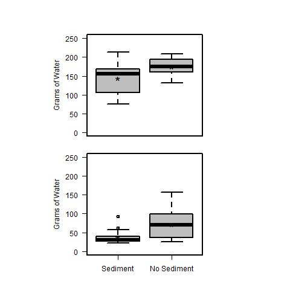

# Analysis of leaf toughness for LPNL experiment 14 Weeks

## Created:

* 14 Feb 2019

## Authors

* KF
* AO
* GH

## Description

## Analysis

### Import Data

    tough2 <- read.table("./data/toughness_week2.csv", header = T, sep = ",") # for the 2 week incubation
    tough14 <- read.table("./data/toughness_week14.csv", header = T, sep = ",") # for the 14 week incubation
    
### Calculate total mass to puncture leaf
    
    tot.mass2 <- tough2$water_mass + tough2$shelf_mass + tough2$res_mass
    tot.mass14 <- tough14$Water_Mass + tough14$shelf_mass + tough14$res_mass

### Calculate the mean mass required to puncture the leaf 
    
Three replicate leaves were randomly selected from the top and sediments from each jar for use the the penetrometer.  Thus we need to calculate the average for each bottle.

    mean.tot.mass2.top <- as.numeric(tapply(tot.mass2[tough2$location == "top"], tough2$bottle[tough2$location == "top"], mean))
    mean.tot.mass2.sed <- as.numeric(tapply(tot.mass2[tough2$location == "sed"], tough2$bottle[tough2$location == "sed"], mean))
    mean.tot.mass14.top <- as.numeric(tapply(tot.mass14[tough14$location == "top"], tough14$bottle[tough14$location == "top"], mean))
    mean.tot.mass14.sed <- as.numeric(tapply(tot.mass14[tough14$location == "sed"], tough14$bottle[tough14$location == "sed"], mean))
    
#### Create Data.frame of mean values
    
    mean.tot.mass2 <- c(mean.tot.mass2.top, mean.tot.mass2.sed)
    mean.tot.mass14 <- c(mean.tot.mass14.top, mean.tot.mass14.sed)
    location <- c(rep("top", 16), rep("sed", 16))
    nutrients <- rep(c("N", "N", "N", "N", "Y", "Y", "Y", "Y", "N", "N", "N", "N", "Y", "Y", "Y", "Y"), 2)
    glucose <- rep(c(rep("N", 8), rep("Y", 8)), 2)

    mean.tough <- data.frame(location, nutrients, glucose, mean.tot.mass2, mean.tot.mass14)    

### 3 - way ANOVA
    
    anova(lm(mean.tot.mass2 ~ location * nutrients * glucose, data = mean.tough))
    anova(lm(mean.tot.mass14 ~ location * nutrients * glucose, data = mean.tough))

############

    Response: mean.tot.mass2
                                Df  Sum Sq Mean Sq F value Pr(>F)  
    location                    1  7172.8  7172.8  5.9248 0.0231 *
    nutrients                   1  3871.9  3871.9  3.1982 0.0869 .
    glucose                     1     6.2     6.2  0.0051 0.9435  
    location:nutrients          1  2110.9  2110.9  1.7436 0.1997  
    location:glucose            1    50.6    50.6  0.0418 0.8399  
    nutrients:glucose           1   162.1   162.1  0.1339 0.7178  
    location:nutrients:glucose  1    83.2    83.2  0.0688 0.7955  
    Residuals                  23 27844.4  1210.6 
    
    Response: mean.tot.mass14
                                Df  Sum Sq Mean Sq F value  Pr(>F)   
    location                    1  9599.2  9599.2 10.7608 0.00316 **
    nutrients                   1  2105.5  2105.5  2.3602 0.13754   
    glucose                     1   591.4   591.4  0.6630 0.42352   
    location:nutrients          1   694.1   694.1  0.7781 0.38648   
    location:glucose            1   892.2   892.2  1.0001 0.32725   
    nutrients:glucose           1   293.8   293.8  0.3294 0.57136   
    location:nutrients:glucose  1   747.9   747.9  0.8384 0.36897   
    Residuals                  24 21409.2   892.1  
    
##########################
    
#### Plot of location effect
  
    par(las = 1, mfcol = c(2, 1))
    par(mar = c(1, 10, 4, 10))
    plot(mean.tot.mass2 ~ location, data = mean.tough, ylim = c(0, 250), axes = F, ylab = "Grams of Water", xlab = "", col = 8 )
    axis(2)
    box()
    text(1, mean(mean.tough$mean.tot.mass2[mean.tough$location == "sed"]), "*", cex = 2)
    text(2, mean(mean.tough$mean.tot.mass2[mean.tough$location == "top"], na.rm = T), "*", cex = 2)
    par(mar = c(4, 10, 1, 10))
    plot(mean.tot.mass14 ~ location, data = mean.tough, ylim = c(0, 250), axes = F, ylab = "Grams of Water", xlab = "", col = 8)
    axis(2)
    axis(1, c("Sediment", "No Sediment"), at = c(1, 2))
    box()
    text(1, mean(mean.tough$mean.tot.mass14[mean.tough$location == "sed"]), "*", cex = 2)
    text(2, mean(mean.tough$mean.tot.mass14[mean.tough$location == "top"]), "*", cex = 2)
    dev.copy(jpeg, "./output/plots/toughness.jpg")
    dev.off()
    

    
    